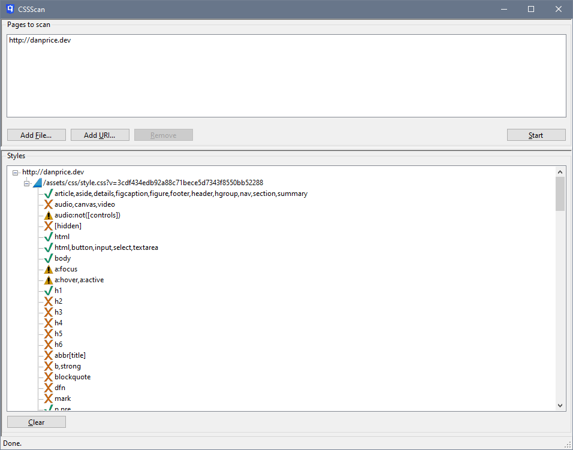

Analyse CSS stylesheet usage for a webpage, either locally or remotely. See how your stylesheet's CSS selectors are used in a page to aid with optimising your CSS.

## Current status
CSSScan will let you check the usage of selectors for all stylesheets referenced from a single page. Future releases will allow link-scraping to check _n_ levels of links from an initial page.

CSSScan uses ExCSS to perform its actual CSS style matching. Currently ExCSS does not support all CSS3 selectors, particularly pseudo-selectors such as `not`. Selectors in your stylesheets that cannot be matched by ExCSS are flagged in your results.

## Download
To download the program, [click here](https://github.com/flexplate/CssScan/releases/latest).
